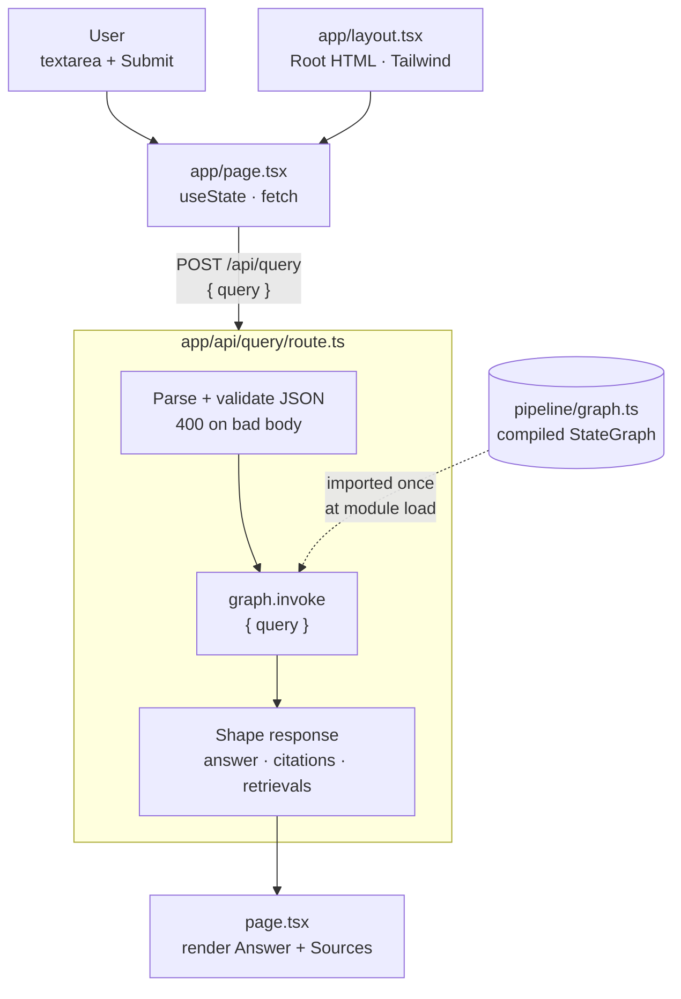

# App — Architecture

Next.js App Router surface for Compliance Copilot. A single-page client UI (`page.tsx`) posts queries to one server route (`api/query/route.ts`), which delegates to the LangGraph pipeline in `pipeline/`.

---

## Overview

---

## Module responsibilities

| Module | Responsibility |
|---|---|
| `app/layout.tsx` | Root HTML shell. Sets `<html lang>`, page metadata, and the Tailwind body classes used as the default surface. |
| `app/globals.css` | Tailwind entry point. No custom CSS. |
| `app/page.tsx` | The entire client UI. Owns `query`, `loading`, `error`, `result` state; calls `/api/query`; renders Answer + Sources panels. Marked `"use client"`. |
| `app/api/query/route.ts` | The only server route. Validates body shape, invokes the compiled graph, maps state → JSON response, owns the 400/500 error contract. |

---

## Request / response contract

`POST /api/query`

| Direction | Field | Type | Notes |
|---|---|---|---|
| in | `query` | `string` (non-empty after trim) | 400 `"Missing or invalid query"` if absent or empty |
| out (200) | `answer` | `string` | `""` if pipeline returned nothing |
| out (200) | `citations` | `Citation[]` | `chunkId` + `marker` per resolved `[^N]` |
| out (200) | `retrievals` | `Retrieval[]` | full hits — UI joins on `chunkId` to display source snippets |
| out (400) | `error` | `string` | invalid JSON or missing/empty query |
| out (500) | `error` | `"Internal pipeline error"` | any exception thrown by `graph.invoke`; original error logged server-side |

The UI in `page.tsx` joins `citations[i].chunkId → retrievals[*].chunkId` to render a 200-char snippet under each source — so dropping `retrievals` from the response would silently break the Sources panel.

---

## Invariants

- **Single graph instance.** `route.ts` imports `graph` at module load; the Pinecone + OpenAI clients constructed inside `pipeline/graph.ts` are reused across requests. Don't `new`-up the pipeline per request.
- **No business logic in `route.ts`.** It is a thin adapter: validate → invoke → shape. Citation parsing, prompt construction, and retrieval all live in `pipeline/`.
- **Client component boundary is `page.tsx`.** `layout.tsx` stays a server component; the `"use client"` directive at the top of `page.tsx` is what enables `useState`/`fetch`. Don't move state into the layout.
- **Errors never leak pipeline internals.** The 500 body is always the literal string `"Internal pipeline error"`; the real error is `console.error`'d only.

---

## Failure modes

| Failure | Surfaces as |
|---|---|
| Missing/non-string `query` | 400 `{ error: "Missing or invalid query" }` — UI shows it inline. |
| Malformed JSON body | 400 `{ error: "Invalid JSON body" }`. |
| Pipeline throws (Pinecone down, OpenAI rate limit, etc.) | 500 `{ error: "Internal pipeline error" }`; UI shows a generic error. |
| `fetch` rejects (network down) | UI catches and shows `"Network error. Please try again."`. |
| Pipeline returns refusal string | 200 with refusal text in `answer`, `citations: []` — UI hides the Sources panel. |
