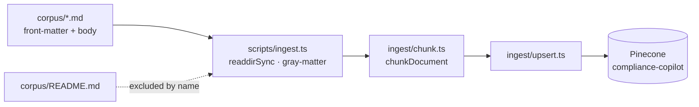

# Corpus — Architecture

Pure-content directory: markdown excerpts (typically 10–60 KB each) that the ingester reads from disk and turns into Pinecone records. No code lives here.

> See `corpus/README.md` for the full front-matter schema, document inventory, source URLs, and "how to add a document" workflow. This file documents only the architectural contract between corpus content and the rest of the system.

---

## Overview

---

## The contract

The directory is a flat folder of `.md` files. The ingester treats every file as a document **except** `README.md`, which is filtered by name in `scripts/ingest.ts`. `ARCHITECTURE.md` is currently not filtered; `scripts/ingest.ts` logs a `status: "skipped"` warning because the file lacks the required v2 front-matter. The archived-v1 subdirectory (`corpus/archive/v1/`) is not traversed because the ingester uses `readdirSync` without recursion.

Each document is a YAML front-matter block (v2 schema — see `corpus/README.md`) followed by a markdown body. The fields are not arbitrary metadata — they map 1:1 to flat Pinecone record fields produced by `ingest/upsert.ts`, and a citation flowing back from the LLM in `pipeline/nodes/generate.ts` is identified by the `citation_id` field set here.

| Front-matter field | Flows to | Used at query time for |
|---|---|---|
| `title` | record `title` | sources panel header |
| `authority` | record `authority` | filter / sources-panel badge ("SEC", "FINRA", etc.) |
| `source` | record `source` | publisher bucket |
| `citation_id` | record `citation_id`, **chunk ID prefix** | `[^N]` marker in answer |
| `jurisdiction` | record `jurisdiction` | filter (US-Federal / SRO / Internal) |
| `doc_type` | record `doc_type` | filter, incl. distinguishing `enforcement` |
| `effective_date` | record `effective_date` | recency ranking |
| `version_status` | record `version_status` | exclude `proposed` / `superseded` from default answer set |
| `supersedes` | record (flat) — not currently queried | audit-trail across doc versions |
| `sunset_date` | not stored | editorial provenance only |
| `source_url` | record `source_url` | deep-link in citation |
| `topic_tags` | record `topic_tags` (array) | filter / reranking |
| `retrieved_at` | not stored | provenance only |

---

## Invariants

- **Filename ≠ identity.** The stable identifier is `citation_id` from front-matter — chunk IDs are `${citation_id}::chunk_${N}`. Renaming a `.md` file does **not** orphan its records; changing `citation_id` does.
- **Body must contain H1/H2/H3 headers** for the chunker to produce meaningful `heading_path` values. A flat document still ingests, but every chunk gets `heading_path: ""`. `paragraph_path` is currently always `""`; paragraph-aware splitting ships in M4 Issue C.
- **Excerpts should stay ≤ 60 KB.** The chunker has no upper bound, but large files produce many chunks and slow re-ingest. Split topic-focused excerpts across multiple files rather than ballooning one.
- **No images, no inline HTML, no code fences with non-prose content** — the chunker is sentence-oriented and treats everything as text to embed.
- **`version_status` mixes into retrieval.** The retriever does not currently filter on `version_status`; documents with `version_status: "proposed"` or `"superseded"` are returned alongside `current` documents. Pipeline-level filtering will be added in a later issue; until then, front-matter must be accurate so that filters can be layered on without recontent.

---

## Failure modes

| Failure | Surfaces as |
|---|---|
| Missing required v2 front-matter field | `scripts/ingest.ts` logs `status: "skipped"` with the missing field names; document is not ingested. |
| Invalid `authority` / `version_status` / `doc_type` / `jurisdiction` enum value | Passes runtime (string coerced) but downstream filters may misbehave. Enum values must match the v2 schema in `corpus/README.md`. |
| Duplicate `citation_id` across two files | Second file's chunks **overwrite** the first's (same ID prefix). Silent — no error. |
| Front-matter YAML syntax error | `gray-matter` throws → ingest exits with code 1. |
| Empty body after front-matter strip | Chunker produces zero chunks; document silently absent from index. |
