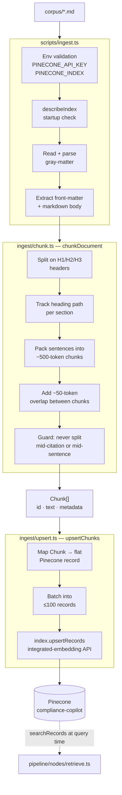

# Ingestion Pipeline — Architecture

Turns `corpus/*.md` into searchable vector records in Pinecone. Run with `pnpm ingest`.

---

## Overview



---

## Record schema

Every record in Pinecone is **flat** — no nested `metadata` object, no object values. The text field is declared by the index's `fieldMap` and is what Pinecone embeds automatically.

| Field | Type | Example |
|---|---|---|
| `id` | string | `12 CFR 1026.18::chunk_0` |
| `chunk_text` | string | chunk body (embedded by Pinecone via index `fieldMap`) |
| `title` | string | `"CFPB Regulation Z — §1026.18"` |
| `source` | string | `"CFPB"` |
| `citation_id` | string | `"12 CFR 1026.18"` |
| `jurisdiction` | string | `"US-Federal"` |
| `doc_type` | string | `"regulation"` |
| `effective_date` | string | `"2011-12-30"` |
| `source_url` | string | canonical `.gov` URL |
| `chunk_index` | number | `0` |
| `heading_path` | string | `"Truth in Lending > Required disclosures"` |

---

## Chunking strategy

```mermaid
flowchart LR
    A[Raw markdown] --> B{Has headers?}
    B -->|Yes| C[Split at H1/H2/H3<br/>boundaries]
    B -->|No| D[Treat whole body<br/>as one section]
    C --> E[Pack sentences<br/>~500 tokens each]
    D --> E
    E --> F[Slide 50-token<br/>overlap window]
    F --> G[Chunk[]]
```

**Token heuristic:** `1 token ≈ 0.75 words` → target word budget = 375 words, overlap = 38 words.

**Citation protection:** sentence splitter guards against splitting on `.` preceded by a digit or uppercase letter, preserving strings like `12 CFR 1026.18` and `U.S.C.` within a single chunk.

**ID format:** `${citationId}::chunk_${globalIndex}` — stable across re-runs, enabling idempotent upserts.

---

## Module responsibilities

| Module | Responsibility |
|---|---|
| `scripts/ingest.ts` | CLI entry point. Env validation, startup index check, file loading, orchestration, JSON-line logging. |
| `ingest/chunk.ts` | Pure function: `chunkDocument(body, metadata) → Chunk[]`. No I/O. |
| `ingest/upsert.ts` | Pinecone I/O only: maps `Chunk[]` to flat records, batches, calls `upsertRecords`. No business logic. |

---

## Re-ingestion

`pnpm ingest` is idempotent. Re-running with the same corpus overwrites existing records (same IDs, same content) — no duplicates, no errors.

To re-ingest after editing a corpus file: just run `pnpm ingest` again.
