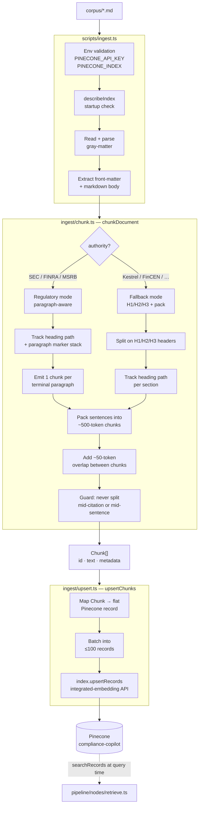

# Ingestion Pipeline — Architecture

Turns `corpus/*.md` into searchable vector records in Pinecone. Run with `pnpm ingest`.

---

## Overview

---

## Record schema

Every record in Pinecone is **flat** — no nested `metadata` object, no object values. The text field is declared by the index's `fieldMap` and is what Pinecone embeds automatically.

| Field | Type | Example |
|---|---|---|
| `id` | string | `17-CFR-240.15l-1::(a)(2)(ii)::p0` (regulatory) · `Kestrel-WSP-Equities::supervisory-hierarchy` (fallback) |
| `chunk_text` | string | chunk body (embedded by Pinecone via index `fieldMap`) |
| `title` | string | `"Regulation Best Interest — 17 CFR 240.15l-1"` |
| `source` | string | `"SEC"` |
| `authority` | string | `"SEC"` / `"FINRA"` / `"MSRB"` / `"FinCEN"` / `"Kestrel"` |
| `citation_id` | string | `"17-CFR-240.15l-1"` |
| `citation_id_display` | string | `"17 CFR 240.15l-1"` (human-readable form shown in LLM prompt citations) |
| `jurisdiction` | string | `"US-Federal"` / `"SRO"` / `"Internal"` |
| `doc_type` | string | `"regulation"` / `"rule"` / `"guidance"` / `"enforcement"` / `"internal"` / `"operational"` |
| `effective_date` | string | `"2020-06-30"` |
| `source_url` | string | canonical `.gov` / `.finra.org` URL or `internal://` scheme |
| `version_status` | string | `"current"` / `"proposed"` / `"superseded"` |
| `topic_tags` | string[] | `["best-interest", "retail-customers"]` |
| `chunk_index` | number | `0` |
| `heading_path` | string | `"§ 240.15l-1 > (a) Best interest obligation > (2) Care obligation"` |
| `paragraph_path` | string | `"(a)(2)(ii)"` (regulatory) · `""` (fallback) |

---

## Chunking strategy

`chunkDocument` dispatches on `metadata.authority`:

- **Regulatory mode** (`SEC`, `FINRA`, `MSRB`) — recognises paragraph markers
  alongside H1/H2/H3 headers. SEC/CFR markers are `(a)` → `(1)` → `(i)`;
  FINRA Supplementary Material markers are `.01`–`.99`; MSRB is `(a)` →
  `(i)`. The chunker walks the body, tracks a heading stack and a paragraph
  marker stack, and emits one chunk per terminal paragraph (the deepest
  `(i)` / `(ii)` / `.NN` level containing prose). Ambiguous Roman-letter
  markers (`(i)`, `(v)`, `(x)`, `(l)`, `(c)`) are resolved using the
  current marker stack: inside a `(N)` they read as Roman numerals, at the
  top level they read as letters.
- **Fallback mode** (`Kestrel`, `FinCEN`, anything else) — the legacy
  H1/H2/H3 + sentence-packing logic. Emits one chunk per heading section,
  packed to the ~500-token budget.

Within either mode, a frame whose prose exceeds the target token budget
is split across multiple chunks via the sentence packer with ~50-token
overlap between adjacent chunks.

**Small-frame merge + heading-residual drop (regulatory mode only).** The
CFR pattern of an intro sentence under a header-with-marker followed by
bulleted sub-items was producing near-empty chunks at the parent level
(e.g. `(b)(2)` → `"Exceptions. The locate requirement does not apply to:"`)
and heading-title-only chunks where a header line's marker had no body
before the next sub-marker (e.g. `(b)` → `"Locate" requirement for short sales.`).
After frame collection, `chunkRegulatory` post-processes the frame list:

1. **Drop** frames whose only non-blank content is the residual extracted
   from a header line — these carry a heading title and no prose.
2. **Merge** frames whose body has fewer than `SMALL_FRAME_WORDS` (default
   `15`) words into the immediately-following deeper-level child frame
   (i.e. a frame whose `paragraphPath` strictly extends the current
   frame's). The parent text is prepended to the child's first chunk; the
   small parent is not emitted as its own chunk. Merging is downward only
   — a small frame followed by a same-level sibling or shallower ancestor
   is emitted as-is. Only the _first_ child receives the merged prefix.

Both transformations are internal to regulatory mode; fallback-mode chunk
IDs and emission are unaffected.

**Token heuristic:** `1 token ≈ 0.75 words` → target word budget = 375 words, overlap = 38 words.

**Citation protection:** sentence splitter guards against splitting on `.` preceded by a digit or uppercase letter, preserving strings like `17 CFR 240.15l-1` and `U.S.C.` within a single chunk.

**ID format:**
- Regulatory: `${citationId}::${paragraphPath}::p${N}` (e.g. `FINRA-Rule-5310::.09::p0`).
- Fallback: `${citationId}::${headingSlug}` for single-chunk sections, `${citationId}::${headingSlug}::p${N}` when a section overflows the token budget. Example: `Kestrel-WSP-Equities::supervisory-hierarchy`, `Kestrel-Best-Execution-Policy::overview::p0`.
  - Slug charset: `[a-z0-9.-]`. Derived from the full heading path (e.g. `"Supervision > (c) Cycles"` → `"supervision-c-cycles"`).
  - Collision handling: if two sections in the same doc produce the same slug, the second gets `-2`, the third `-3`, etc.

Both formats are stable across re-runs, enabling idempotent upserts.

---

## Module responsibilities

| Module | Responsibility |
|---|---|
| `scripts/ingest.ts` | CLI entry point. Env validation, startup index check, file loading, orchestration, JSON-line logging. |
| `ingest/chunk.ts` | Pure function: `chunkDocument(body, metadata) → Chunk[]`. No I/O. |
| `ingest/upsert.ts` | Pinecone I/O only: maps `Chunk[]` to flat records, batches, calls `upsertRecords`. No business logic. |

---

## Re-ingestion

`pnpm ingest` is idempotent. Re-running with the same corpus overwrites existing records (same IDs, same content) — no duplicates, no errors.

To re-ingest after editing a corpus file: just run `pnpm ingest` again.
