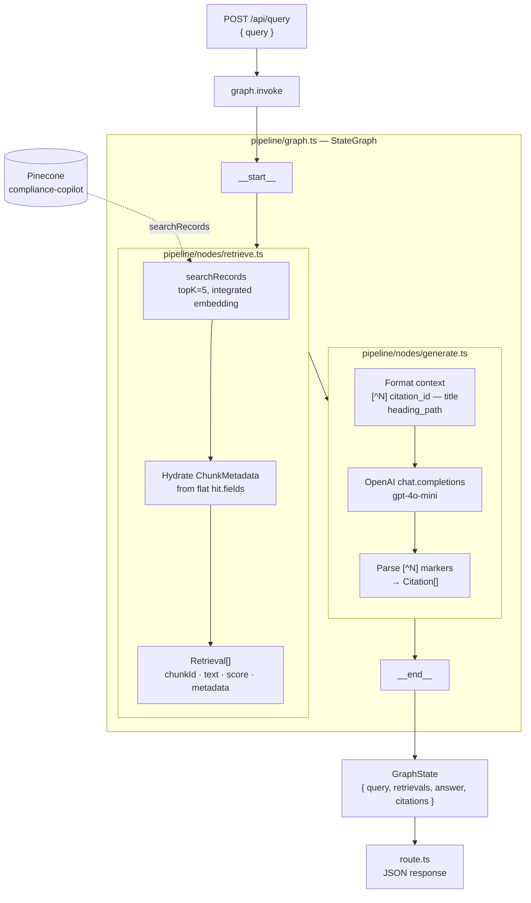

# RAG Pipeline — Architecture

A two-node LangGraph `StateGraph` that turns a user query into a grounded, cited answer. Invoked from `app/api/query/route.ts` via `graph.invoke({ query })`.

---

## Overview

---

## State

`pipeline/state.ts` declares `GraphStateAnnotation`. The `retrievals` channel uses an **append reducer** (`(a, b) => [...a, ...b]`) so future multi-hop retrieval can accumulate hits across passes without overwriting.

| Channel | Type | Reducer | Set by |
|---|---|---|---|
| `query` | `string` | replace | input |
| `retrievals` | `Retrieval[]` | append | `retrieve` |
| `answer` | `string \| undefined` | replace | `generate` |
| `citations` | `Citation[] \| undefined` | replace | `generate` |

---

## Module responsibilities

| Module | Responsibility |
|---|---|
| `graph.ts` | Wires the `StateGraph` (`retrieve → generate`), constructs the singleton Pinecone + OpenAI clients at import time, exports a compiled graph. |
| `state.ts` | Declares `GraphStateAnnotation` and exports the derived `GraphState` type. |
| `nodes/retrieve.ts` | Pinecone-only I/O. Calls `searchRecords` (integrated-embedding API) and rebuilds `ChunkMetadata` from the flat record fields stored at ingest time. |
| `nodes/generate.ts` | OpenAI-only I/O. Builds the grounded prompt, parses `[^N]` markers from the model's reply into `Citation[]`. |

---

## Grounded-prompt contract

`generate.ts` is built around a strict contract that the rest of the system depends on:

- Each chunk in the prompt is prefixed with `[^N] {citation_id} — {title} ({heading_path})`. **Without this header**, the model can't verify chunks against a question that names a specific regulation and conservatively refuses.
- The system prompt instructs the model to reply with the **exact** string `"I cannot answer from the available sources."` when chunks are insufficient. Tests assert on this string — don't change the wording in one place without the other.
- Only `[^N]` markers where `1 ≤ N ≤ retrievals.length` produce `Citation` entries; stray markers are ignored.

---

## Failure modes

| Failure | Surfaces as |
|---|---|
| Pinecone index empty / wrong field mapping | `retrievals: []` → model returns the refusal string. |
| OpenAI rate limit / network error | Exception bubbles to `route.ts`; client gets a 5xx. |
| Model fabricates citations | Out-of-range `[^N]` markers are silently dropped from `citations` (text remains in `answer`). |

---

## Extension points

The graph is intentionally linear today, but the shape supports the planned post-MVP nodes without rewiring existing nodes:

- **Classifier before retrieve** — `addConditionalEdges` from a new `classify` node to either `retrieve` or a direct `generate`.
- **Multi-hop retrieve** — re-enter `retrieve` with a refined query; the append reducer on `retrievals` already supports accumulation.
- **Self-eval / CRAG** — insert a `critique` node between `generate` and `__end__` with a conditional loop back to `retrieve`.
